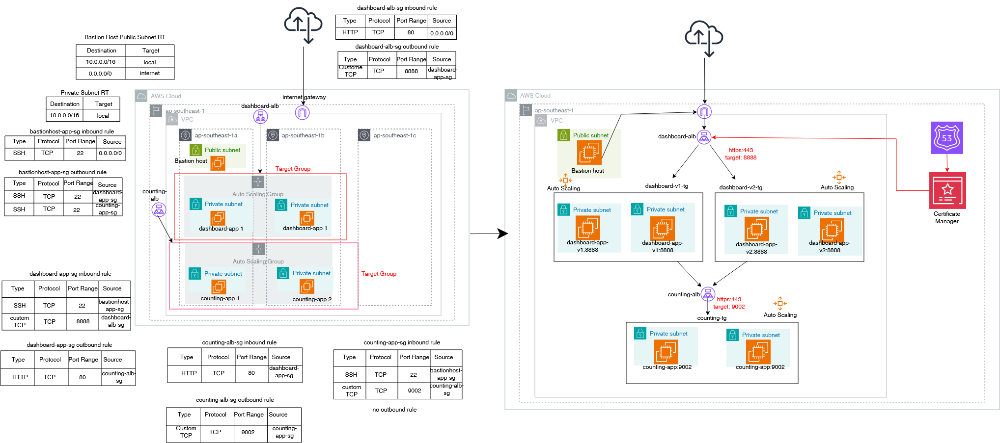
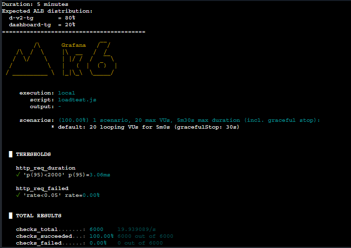
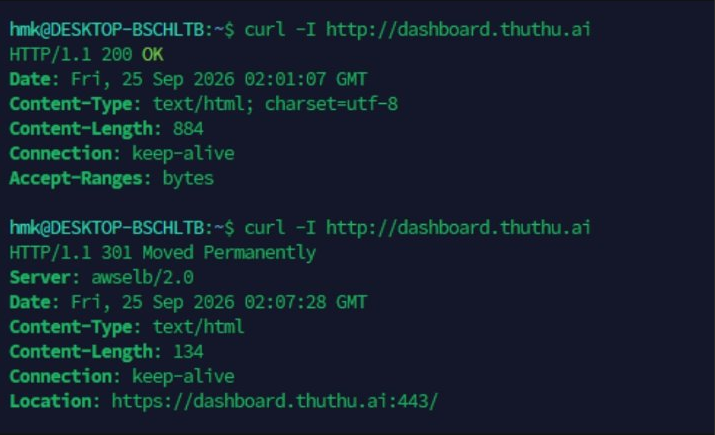
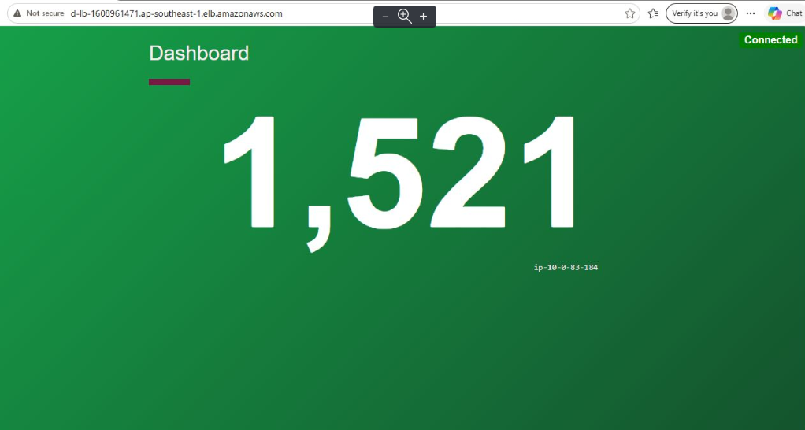
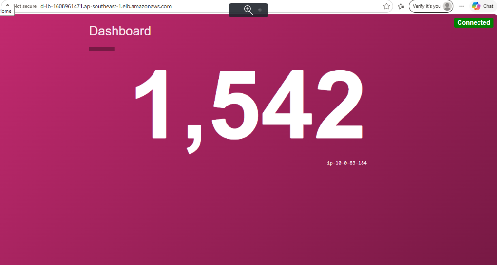

## Blue Green Deployment

## Architecture

### Deploy two apps (dashboard+counting) on EC2 with launch template using Autoscaling, configure security groups
### Run as systemd services with specific users/groups instead of root
### Install two application load balancer with internet for dashboard frontend app and internal for counting backend app
### Configured two ALBs with Security Groups and target groups
### Set up Route 53 private hosted zone and ACM for internal https
### Build a Root CA -> Intermediate CA -> Leaf CA using openSSL (PCA, Step CA, openSSL) and import to ACM
### Update blue-green deployment, sync load balancer weight 20/80, 50/50, 80/20, 0/100 from v1 to v2 

### For load testing, use hey, k6 and locust etc
### Http to https redirection, in http listener, edit redirect to url

# HashiCorp Dashboard & Counting

## Dashboard

### This is real infra fundamentals ClickOps